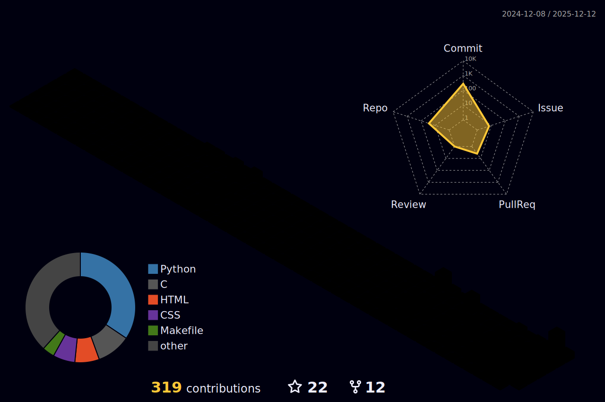

## Hi there! 👋 

<h1 align="center"> <a href="https://sunguoqi.com/">  </a> </h1>

🎓 Undergraduate in Automation @ Guangdong University of Technology  

📡 HAM Radio Enthusiast | HAM Callsign: BG7KMT | HF/VHF/UHF & SDR & CW  

⚙️ Embedded Developer: AT89C52 | STM32 | ESP32 | MSPM0G3507    

🎹 Producer: Jazz | Future Bass | Complextro | Artcore  

🦀 Python & Cpp | 🤖 OpenCV & YOLO | 🏹 Archery & 🏸 Badminton 
<!--
**Kyunana097/Kyunana097** is a ✨ _special_ ✨ repository because its `README.md` (this file) appears on your GitHub profile.

Here are some ideas to get you started:

- 🔭 I’m currently working on ...
- 🌱 I’m currently learning ...
- 👯 I’m looking to collaborate on ...
- 🤔 I’m looking for help with ...
- 💬 Ask me about ...
- 📫 How to reach me: ...
- 😄 Pronouns: ...
- ⚡ Fun fact: ...
-->

## 🛠️ Working Environment
<p align="center">
  
  
  
</p>


<!--START_SECTION:waka-->


**🐱 My GitHub Data** 

> 📦 790.5 kB Used in GitHub's Storage 
 > 
> 🏆 269 Contributions in the Year 2025
 > 
> 🚫 Not Opted to Hire
 > 
> 📜 28 Public Repositories 
 > 
> 🔑 1 Private Repositories 
 > 
**I'm an Early 🐤** 

```text
🌞 Morning                155 commits         ██████████░░░░░░░░░░░░░░░   38.08 % 
🌆 Daytime                124 commits         ████████░░░░░░░░░░░░░░░░░   30.47 % 
🌃 Evening                68 commits          ████░░░░░░░░░░░░░░░░░░░░░   16.71 % 
🌙 Night                  60 commits          ████░░░░░░░░░░░░░░░░░░░░░   14.74 % 
```
📅 **I'm Most Productive on Sunday** 

```text
Monday                   55 commits          ███░░░░░░░░░░░░░░░░░░░░░░   13.51 % 
Tuesday                  25 commits          ██░░░░░░░░░░░░░░░░░░░░░░░   06.14 % 
Wednesday                36 commits          ██░░░░░░░░░░░░░░░░░░░░░░░   08.85 % 
Thursday                 51 commits          ███░░░░░░░░░░░░░░░░░░░░░░   12.53 % 
Friday                   72 commits          ████░░░░░░░░░░░░░░░░░░░░░   17.69 % 
Saturday                 37 commits          ██░░░░░░░░░░░░░░░░░░░░░░░   09.09 % 
Sunday                   131 commits         ████████░░░░░░░░░░░░░░░░░   32.19 % 
```


📊 **This Week I Spent My Time On** 

```text
🕑︎ Time Zone: Asia/Shanghai

💬 Programming Languages: 
No Activity Tracked This Week

🔥 Editors: 
No Activity Tracked This Week

🐱‍💻 Projects: 
No Activity Tracked This Week

💻 Operating System: 
No Activity Tracked This Week
```

**I Mostly Code in Python** 

```text
Python                   4 repos             ███████░░░░░░░░░░░░░░░░░░   26.67 % 
JavaScript               2 repos             ███░░░░░░░░░░░░░░░░░░░░░░   13.33 % 
HTML                     2 repos             ███░░░░░░░░░░░░░░░░░░░░░░   13.33 % 
CSS                      1 repo              ██░░░░░░░░░░░░░░░░░░░░░░░   06.67 % 
C++                      1 repo              ██░░░░░░░░░░░░░░░░░░░░░░░   06.67 % 
```


**Timeline**


 Last Updated on 09/12/2025 03:57:23 UTC
<!--END_SECTION:waka-->

> Make  Great Again !
