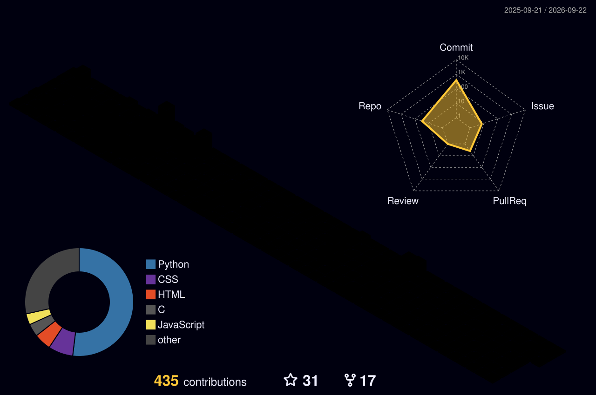

## Hi there! 👋 

<a href="https://git.io/typing-svg"></a>

🎓 Undergraduate in Automation @ Guangdong University of Technology  

📡 HAM Radio Enthusiast | Callsign: BG7KMT | HF/VHF/UHF & SDR & CW  

⚙️ Embedded Developer: AT89C52 | STM32 | ESP32 | MSPM0G3507    

🎹 Producer: Jazz | Future Bass | Complextro | Artcore  

🐍 Fool-stack Engineer | 🤖 OpenCV & YOLO | 🏹 Archery & 🏸 Badminton 

## 🛠️ Working Environment
<p align="center">
  <a href="https://www.jetbrains.com/clion/" target="_blank" rel="noopener noreferrer">
    
  </a>
  <a href="https://code.visualstudio.com/" target="_blank" rel="noopener noreferrer">
    
  </a>
  <a href="https://ubuntu.com/" target="_blank" rel="noopener noreferrer">
    
  </a>
</p>
<p align="center">
</p>


<!--START_SECTION:waka-->


**我是早起的 🐤** 

```text
🌞 早晨                     212 commits         ⣿⣿⣿⣿⣿⣿⣿⣿⣀⣀⣀⣀⣀⣀⣀⣀⣀⣀⣀⣀⣀⣀⣀⣀⣀   30.99 % 
🌆 白天                     224 commits         ⣿⣿⣿⣿⣿⣿⣿⣿⣀⣀⣀⣀⣀⣀⣀⣀⣀⣀⣀⣀⣀⣀⣀⣀⣀   32.75 % 
🌃 傍晚                     171 commits         ⣿⣿⣿⣿⣿⣿⣀⣀⣀⣀⣀⣀⣀⣀⣀⣀⣀⣀⣀⣀⣀⣀⣀⣀⣀   25.00 % 
🌙 晚上                     77 commits          ⣿⣿⣿⣀⣀⣀⣀⣀⣀⣀⣀⣀⣀⣀⣀⣀⣀⣀⣀⣀⣀⣀⣀⣀⣀   11.26 % 
```
📅 **我最有效率是在 星期日** 

```text
星期一                      125 commits         ⣿⣿⣿⣿⣿⣀⣀⣀⣀⣀⣀⣀⣀⣀⣀⣀⣀⣀⣀⣀⣀⣀⣀⣀⣀   18.27 % 
星期二                      91 commits          ⣿⣿⣿⣀⣀⣀⣀⣀⣀⣀⣀⣀⣀⣀⣀⣀⣀⣀⣀⣀⣀⣀⣀⣀⣀   13.30 % 
星期三                      67 commits          ⣿⣿⣀⣀⣀⣀⣀⣀⣀⣀⣀⣀⣀⣀⣀⣀⣀⣀⣀⣀⣀⣀⣀⣀⣀   09.80 % 
星期四                      100 commits         ⣿⣿⣿⣿⣀⣀⣀⣀⣀⣀⣀⣀⣀⣀⣀⣀⣀⣀⣀⣀⣀⣀⣀⣀⣀   14.62 % 
星期五                      74 commits          ⣿⣿⣿⣀⣀⣀⣀⣀⣀⣀⣀⣀⣀⣀⣀⣀⣀⣀⣀⣀⣀⣀⣀⣀⣀   10.82 % 
星期六                      59 commits          ⣿⣿⣀⣀⣀⣀⣀⣀⣀⣀⣀⣀⣀⣀⣀⣀⣀⣀⣀⣀⣀⣀⣀⣀⣀   08.63 % 
星期日                      168 commits         ⣿⣿⣿⣿⣿⣿⣀⣀⣀⣀⣀⣀⣀⣀⣀⣀⣀⣀⣀⣀⣀⣀⣀⣀⣀   24.56 % 
```


📊 **本周消耗时间** 

```text
🕑︎ 时区: Asia/Shanghai

💬 编程语言: 
Other                    30 hrs 5 mins       ⣿⣿⣿⣿⣿⣿⣿⣿⣿⣿⣿⣿⣿⣿⣿⣿⣿⣿⣿⣿⣀⣀⣀⣀⣀   78.92 % 
Python                   5 hrs 39 mins       ⣿⣿⣿⣿⣀⣀⣀⣀⣀⣀⣀⣀⣀⣀⣀⣀⣀⣀⣀⣀⣀⣀⣀⣀⣀   14.86 % 
JSON                     47 mins             ⣿⣀⣀⣀⣀⣀⣀⣀⣀⣀⣀⣀⣀⣀⣀⣀⣀⣀⣀⣀⣀⣀⣀⣀⣀   02.06 % 
Bash                     37 mins             ⣀⣀⣀⣀⣀⣀⣀⣀⣀⣀⣀⣀⣀⣀⣀⣀⣀⣀⣀⣀⣀⣀⣀⣀⣀   01.64 % 
Git Config               26 mins             ⣀⣀⣀⣀⣀⣀⣀⣀⣀⣀⣀⣀⣀⣀⣀⣀⣀⣀⣀⣀⣀⣀⣀⣀⣀   01.14 % 

🔥 编辑器: 
Edge                     30 hrs 45 mins      ⣿⣿⣿⣿⣿⣿⣿⣿⣿⣿⣿⣿⣿⣿⣿⣿⣿⣿⣿⣿⣀⣀⣀⣀⣀   80.65 % 
VS Code                  7 hrs 18 mins       ⣿⣿⣿⣿⣿⣀⣀⣀⣀⣀⣀⣀⣀⣀⣀⣀⣀⣀⣀⣀⣀⣀⣀⣀⣀   19.17 % 
Obsidian                 4 mins              ⣀⣀⣀⣀⣀⣀⣀⣀⣀⣀⣀⣀⣀⣀⣀⣀⣀⣀⣀⣀⣀⣀⣀⣀⣀   00.18 % 

💻 操作系统: 
Linux                    23 hrs 51 mins      ⣿⣿⣿⣿⣿⣿⣿⣿⣿⣿⣿⣿⣿⣿⣿⣿⣀⣀⣀⣀⣀⣀⣀⣀⣀   62.57 % 
Windows                  14 hrs 16 mins      ⣿⣿⣿⣿⣿⣿⣿⣿⣿⣀⣀⣀⣀⣀⣀⣀⣀⣀⣀⣀⣀⣀⣀⣀⣀   37.43 % 
```


 Last Updated on 31/12/2025 01:55:41 UTC
<!--END_SECTION:waka-->

> Make   <a href="https://archlinux.org/" target="_blank" rel="noopener noreferrer">
  </a> Great Again !  
> 
