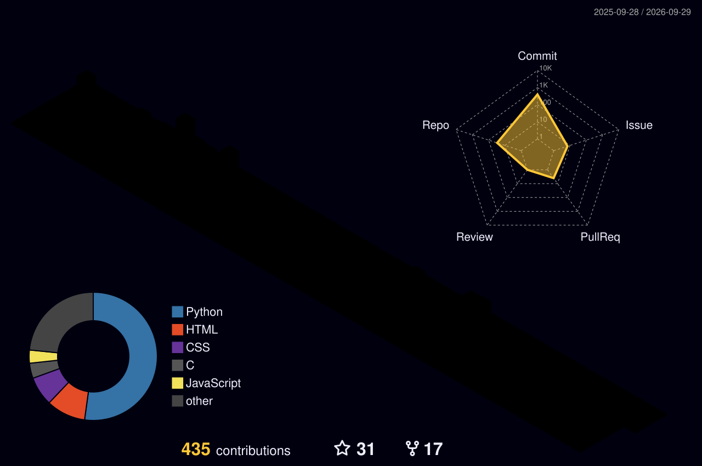

## Hi there! 👋 

<a href="https://git.io/typing-svg"></a>

🎓 Undergraduate in Automation @ Guangdong University of Technology  

📡 HAM Radio Enthusiast | Callsign: BG7KMT | HF/VHF/UHF & SDR & CW  

⚙️ Embedded Developer: AT89C52 | STM32 | ESP32 | MSPM0G3507    

🎹 Producer: Jazz | Future Bass | Complextro | Artcore  

🐍 Fool-stack Engineer | 🤖 OpenCV & YOLO | 🏹 Archery & 🏸 Badminton 

## 🛠️ Working Environment
<p align="center">
  <a href="https://www.jetbrains.com/clion/" target="_blank" rel="noopener noreferrer">
    
  </a>
  <a href="https://code.visualstudio.com/" target="_blank" rel="noopener noreferrer">
    
  </a>
  <a href="https://ubuntu.com/" target="_blank" rel="noopener noreferrer">
    
  </a>
</p>
<p align="center">
</p>


<!--START_SECTION:waka-->


**我是早鸟 🐤** 

```text
🌞 早晨                     250 commits         ⣿⣿⣿⣿⣿⣿⣿⣿⣀⣀⣀⣀⣀⣀⣀⣀⣀⣀⣀⣀⣀⣀⣀⣀⣀   31.33 % 
🌆 白天                     258 commits         ⣿⣿⣿⣿⣿⣿⣿⣿⣀⣀⣀⣀⣀⣀⣀⣀⣀⣀⣀⣀⣀⣀⣀⣀⣀   32.33 % 
🌃 傍晚                     205 commits         ⣿⣿⣿⣿⣿⣿⣀⣀⣀⣀⣀⣀⣀⣀⣀⣀⣀⣀⣀⣀⣀⣀⣀⣀⣀   25.69 % 
🌙 晚上                     85 commits          ⣿⣿⣿⣀⣀⣀⣀⣀⣀⣀⣀⣀⣀⣀⣀⣀⣀⣀⣀⣀⣀⣀⣀⣀⣀   10.65 % 
```
📅 **星期日 时的我最有干劲** 

```text
星期一                      144 commits         ⣿⣿⣿⣿⣿⣀⣀⣀⣀⣀⣀⣀⣀⣀⣀⣀⣀⣀⣀⣀⣀⣀⣀⣀⣀   18.05 % 
星期二                      102 commits         ⣿⣿⣿⣀⣀⣀⣀⣀⣀⣀⣀⣀⣀⣀⣀⣀⣀⣀⣀⣀⣀⣀⣀⣀⣀   12.78 % 
星期三                      82 commits          ⣿⣿⣿⣀⣀⣀⣀⣀⣀⣀⣀⣀⣀⣀⣀⣀⣀⣀⣀⣀⣀⣀⣀⣀⣀   10.28 % 
星期四                      130 commits         ⣿⣿⣿⣿⣀⣀⣀⣀⣀⣀⣀⣀⣀⣀⣀⣀⣀⣀⣀⣀⣀⣀⣀⣀⣀   16.29 % 
星期五                      88 commits          ⣿⣿⣿⣀⣀⣀⣀⣀⣀⣀⣀⣀⣀⣀⣀⣀⣀⣀⣀⣀⣀⣀⣀⣀⣀   11.03 % 
星期六                      70 commits          ⣿⣿⣀⣀⣀⣀⣀⣀⣀⣀⣀⣀⣀⣀⣀⣀⣀⣀⣀⣀⣀⣀⣀⣀⣀   08.77 % 
星期日                      182 commits         ⣿⣿⣿⣿⣿⣿⣀⣀⣀⣀⣀⣀⣀⣀⣀⣀⣀⣀⣀⣀⣀⣀⣀⣀⣀   22.81 % 
```


📊 **本周消耗时间** 

```text
🕑︎ 时区: Asia/Shanghai

💬 编程语言: 
Markdown                 2 hrs               ⣿⣿⣿⣿⣿⣿⣿⣿⣿⣿⣿⣿⣿⣿⣿⣀⣀⣀⣀⣀⣀⣀⣀⣀⣀   58.67 % 
Python                   1 hr 12 mins        ⣿⣿⣿⣿⣿⣿⣿⣿⣿⣀⣀⣀⣀⣀⣀⣀⣀⣀⣀⣀⣀⣀⣀⣀⣀   34.99 % 
Other                    11 mins             ⣿⣀⣀⣀⣀⣀⣀⣀⣀⣀⣀⣀⣀⣀⣀⣀⣀⣀⣀⣀⣀⣀⣀⣀⣀   05.70 % 
Text                     1 min               ⣀⣀⣀⣀⣀⣀⣀⣀⣀⣀⣀⣀⣀⣀⣀⣀⣀⣀⣀⣀⣀⣀⣀⣀⣀   00.64 % 

🔥 编辑器: 
VS Code                  2 hrs 47 mins       ⣿⣿⣿⣿⣿⣿⣿⣿⣿⣿⣿⣿⣿⣿⣿⣿⣿⣿⣿⣿⣀⣀⣀⣀⣀   79.84 % 
Obsidian                 38 mins             ⣿⣿⣿⣿⣿⣀⣀⣀⣀⣀⣀⣀⣀⣀⣀⣀⣀⣀⣀⣀⣀⣀⣀⣀⣀   18.50 % 
Claude Code              3 mins              ⣀⣀⣀⣀⣀⣀⣀⣀⣀⣀⣀⣀⣀⣀⣀⣀⣀⣀⣀⣀⣀⣀⣀⣀⣀   01.66 % 

💻 操作系统: 
Linux                    2 hrs 7 mins        ⣿⣿⣿⣿⣿⣿⣿⣿⣿⣿⣿⣿⣿⣿⣿⣿⣀⣀⣀⣀⣀⣀⣀⣀⣀   62.16 % 
Windows                  1 hr 17 mins        ⣿⣿⣿⣿⣿⣿⣿⣿⣿⣀⣀⣀⣀⣀⣀⣀⣀⣀⣀⣀⣀⣀⣀⣀⣀   37.84 % 
```

🤖 **AI Coding This Week** 

```text
⏱ AI Coding Time: 2 hrs 37 mins (76.68%)

✍️ 2,920 lines written by AI, 6 lines written by hand (99.79% AI-written)

🔤 457,389 Input Tokens, 193,242 Output Tokens

💵 $59.35 Estimated AI Cost This Week

🧠 6 AI Sessions, 18 AI Prompts

Deepseek                 3,579 lines         ⣿⣿⣿⣿⣿⣿⣿⣿⣿⣿⣿⣿⣿⣿⣿⣿⣿⣿⣿⣿⣿⣿⣿⣿⣿   100.00 % 
Claude-Code              0 lines             ⣀⣀⣀⣀⣀⣀⣀⣀⣀⣀⣀⣀⣀⣀⣀⣀⣀⣀⣀⣀⣀⣀⣀⣀⣀   00.00 % 

🔎 AI Coding Insights:
🤖 AI-Driven — 99.79% of written lines came from AI
📄 Detailed Prompter — average 600 characters per prompt
🔁 Iterative Prompter — average 3 prompts per session
🚀 High AI Trust — 0.2% of changed lines were hand-edited
```


 Last Updated on 01/10/2026 04:49:24 UTC
<!--END_SECTION:waka-->

> Make   <a href="https://archlinux.org/" target="_blank" rel="noopener noreferrer">
  </a> Great Again !  
> 
